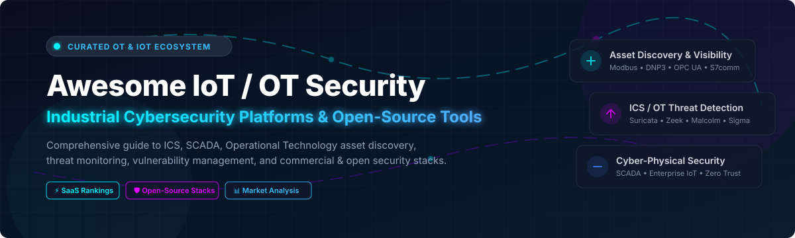

  

# 🛡️ Awesome IoT / OT Security Platforms & Tools

  
  
  
  
  

> **A curated landscape of Industrial Control Systems (ICS), Operational Technology (OT), SCADA, Cyber-Physical Systems (CPS), and Enterprise IoT Security platforms, commercial SaaS offerings, market intelligence, and open-source monitoring tooling.**

---

## 📌 Overview & SEO Keywords

This repository provides an authoritative, community-curated reference directory for cybersecurity teams, OT defenders, industrial automation engineers, CISO offices, and security researchers. 

Key topics & coverage areas:
* 🌐 **Operational Technology (OT) & ICS Security**: Continuous passive network monitoring, anomaly detection, asset discovery, vulnerability management, and risk scoring across Purdue Model levels 0–3.
* 🏭 **Cyber-Physical Systems (CPS) Protection**: Enterprise IoT, Medical IoT (IoMT), Building Management Systems (BMS), SCADA networks, PLCs, RTUs, and industrial sensors.
* 📡 **Industrial Protocol Inspection**: Deep packet inspection (DPI) for Modbus, DNP3, Ethernet/IP (CIP), S7comm, IEC 61850, OPC UA, BACnet, and PROFINET.
* 📊 **Market Intelligence & SaaS Pricing**: Enterprise pricing models, free trial availability, market sizing, acquisition trends, and valuation data for top cyber-physical security vendors.
* 🛠️ **Open-Source Industrial Security**: Community intrusion detection systems (IDS), packet analysis, network mappers, protocol parsers, and threat intelligence.

---

## 📋 Table of Contents

- [🏢 SaaS & Commercial Hosted Platforms](#-saas--commercial-hosted-platforms)
- [🔓 Open-Source GitHub Projects](#-open-source-github-projects)
- [🛠️ Framework for Custom Passive OT Monitoring](#%EF%B8%8F-framework-for-custom-passive-ot-monitoring)
- [🤝 How to Contribute](#-how-to-contribute)
- [💖 Support & Sponsorship](#-support--sponsorship)
- [⚠️ Disclaimer](#%EF%B8%8F-disclaimer)
- [⭐ Star History](#-star-history)

---

## 🏢 SaaS & Commercial Hosted Platforms

### 📈 Market Landscape & Dynamics
The global IoT and OT security market size is estimated at **$25 billion–$30 billion** (projected to exceed $60+ billion by 2030). The market is **moderately fragmented**, undergoing rapid consolidation as major enterprise cybersecurity providers (Microsoft, Palo Alto Networks, Cisco, Tenable) and industrial automation conglomerates (Accenture/Dragos, Mitsubishi Electric/Nozomi Networks, Honeywell/SCADAfence, ServiceNow/Armis) acquire specialized cyber-physical security startups.

| 🏢 Product | 📝 Description | 💰 Valuation / Revenue | 🏷️ Starting Pricing | 🎁 Free Tier / Trial Limit |
| :--- | :--- | :--- | :--- | :--- |
| **[Microsoft Defender for IoT](https://www.microsoft.com/en-us/security/business/endpoint-security/microsoft-defender-iot)** | Agentless OT/IoT security providing asset discovery, vulnerability management, and threat detection integrated with Defender XDR and Sentinel. | Market Cap: ~$3.84 Trillion | Starts at ~$70.72/device/month (billed annually) for Enterprise IoT add-on; site-tier packages for OT. | 30-day free trial supporting up to 100 devices; up to 5 EIoT devices included per Microsoft 365 E5 user license. |
| **[Cisco Cyber Vision](https://www.cisco.com/c/en/us/products/security/cyber-vision/index.html)** | Cisco’s OT security solution providing visibility into industrial assets embedded natively into network switches and firewalls. | Market Cap: ~$442 Billion | Starts at ~$2,500/year per sensor/switch integration tier. | 60-day interactive sandbox demo and trial through Cisco dCloud. |
| **[Palo Alto IoT Security](https://www.paloaltonetworks.com/network-security/iot-security)** | Machine learning-driven zero trust IoT/OT device visibility, risk scoring, and policy enforcement via Next-Gen Firewalls. | Market Cap: ~$330 Billion | Starts at ~$3,600/year subscription per Next-Generation Firewall instance. | 30-day free trial on supported Palo Alto NGFW / Panorama deployments. |
| **[Armis](https://www.armis.com/)** | Agentless asset intelligence platform for IT, IoT, OT, and IoMT devices with continuous exposure management (acquired by ServiceNow). | Acquired for $7.75 Billion (ARR: ~$340M) | Starts at ~$12,000/year for entry enterprise tier (asset-scaled subscription). | 30-day guided enterprise trial demo; no permanent free tier. |
| **[Tenable OT Security](https://www.tenable.com/products/tenable-ot)** | OT asset discovery, vulnerability management, and threat detection integrated into the Tenable Exposure Management ecosystem. | Market Cap: ~$4.1 Billion (ARR: ~$1.07B) | Starts at ~$5,000/year per site subscription bundle. | 30-day free trial of Tenable Exposure Platform / OT Security. |
| **[Dragos Platform](https://www.dragos.com/)** | Specialized industrial cybersecurity platform offering deep ICS threat intelligence, network monitoring, and incident response (majority owned by Accenture). | Valued at $3.25 Billion (ARR: ~$208M) | Starts at ~$25,000/year per monitored site deployment. | Free access available for small utilities via Dragos Community Defense Program; 30-day guided evaluation. |
| **[Claroty](https://claroty.com/)** | Cyber-physical systems (CPS) protection platform for OT, IoT, IoMT, and building management systems. | Valued at ~$3.0 Billion (ARR: >$200M) | Starts at ~$15,000/year enterprise subscription tier. | Interactive live demo sandbox on request; no self-service free tier. |
| **[Forescout Technologies](https://www.forescout.com/)** | Continuous automation and device visibility platform securing IT, OT, IoT, and medical network segments (owned by Advent International). | Valued at ~$1.9 Billion (ARR: ~$300M–$500M) | Starts at ~$5,000 per hardware/virtual appliance unit plus subscription. | Request-based enterprise lab demo and POC evaluation. |
| **[Nozomi Networks](https://www.nozominetworks.com/)** | OT/IoT security platform offering deep network visibility, threat detection, and asset intelligence (acquired by Mitsubishi Electric). | Acquired for ~$1.0 Billion (ARR: >$100M) | Starts at ~$10,000/year via Nozomi OnePass subscription model. | Guided platform demo on request; free Guardian Community Edition retired in Oct 2023. |
| **[SCADAfence](https://www.scadafence.com/)** | Continuous OT/IoT network monitoring, governance, and asset discovery platform (acquired by Honeywell, integrated in Honeywell Forge). | Acquired for $52 Million | Starts at ~$8,000/year as part of Honeywell Forge Cybersecurity+ suite. | Enterprise sandbox demo via Honeywell Forge; no standalone free trial. |

---

## 🔓 Open-Source GitHub Projects

Below is a curated selection of open-source tools, protocol parsers, IDS engines, and security frameworks relevant to IoT and OT network security monitoring, ranked by GitHub Star count.

| 📦 Open-Source Project | 📝 Description | ⭐ Star Count |
| :--- | :--- | :--- |
| **[Metasploit Framework](https://github.com/rapid7/metasploit-framework)** | World-leading penetration testing framework containing numerous modules for auditing and testing ICS/SCADA hardware and protocols. |  |
| **[Nmap](https://github.com/nmap/nmap)** | Essential network discovery and security auditing utility with extensive Nmap Scripting Engine (NSE) scripts for OT/ICS protocol identification (Modbus, BACnet, S7, Ethernet/IP). |  |
| **[Scapy](https://github.com/secdev/scapy)** | Powerful Python-based packet manipulation program and library used to craft, forge, and decode industrial protocol packets (Modbus, DNP3, IEC-60870-5-104). |  |
| **[Wazuh](https://github.com/wazuh/wazuh)** | Open-source security monitoring platform adapted for endpoint security and centralized log analysis in hybrid IT/OT environments. |  |
| **[Sigma](https://github.com/SigmaHQ/sigma)** | Generic open detection format for log events, including community-contributed rules targeting ICS protocols and industrial attack techniques. |  |
| **[Zeek](https://github.com/zeek/zeek)** | Powerful open-source network security monitoring framework widely used for passive visibility, extensible via ICS protocol parsers (ICSNPP). |  |
| **[Suricata](https://github.com/OISF/suricata)** | High-performance open-source network IDS/IPS and monitoring engine with native rulesets for Modbus, DNP3, and ENIP/CIP traffic. |  |
| **[Snort 3](https://github.com/snort3/snort3)** | Next-generation open-source intrusion detection system widely deployed for packet inspection and protocol anomaly detection. |  |
| **[OpenPLC V3](https://github.com/thiagoralves/OpenPLC_v3)** | Open-source Programmable Logic Controller software suite used for research, testing, and simulating industrial control environments. |  |
| **[Industrial Security Exploitation Framework (ISF)](https://github.com/dark-lbp/isf)** | Exploitation framework based on Python targeting industrial control systems (ICS), PLC devices, and SCADA protocols. |  |
| **[GRASSMARLIN](https://github.com/nsacyber/GRASSMARLIN)** | NSA open-source tool for passive network mapping and asset discovery of Industrial Control Systems (ICS) and SCADA networks. |  |
| **[CISA CHIRP](https://github.com/cisagov/CHIRP)** | CISA's CISA Hunt and Incident Response Program tool built to scan post-compromise artifacts across network systems and critical infrastructure. |  |
| **[Malcolm](https://github.com/idaholab/Malcolm)** | Idaho National Laboratory's open-source network traffic analysis suite designed for easy deployment and visualization of OT/ICS PCAP and live traffic. |  |
| **[OT Protocol Parsers (ICSNPP)](https://github.com/DINA-community/ot-parsers)** | Collections of open-source Zeek protocol parsers for industrial control protocols (Modbus, S7comm, DNP3, IEC 61850, OPC UA). |  |
| **[ICS Security Tools](https://github.com/automayt/ICS-Security-Tools)** | Curated collection of open-source scripts, PLC testbeds, and utilities for OT vulnerability research and protocol analysis. |  |

---

## 🛠️ Framework for Custom Passive OT Monitoring

For organizations building low-cost or research-oriented visibility stacks:
1. **SPAN/TAP Deployment**: Deploy passive network taps or SPAN ports on core industrial switches at Purdue Model Levels 1–3.
2. **Network Parsing**: Run **Zeek** and **Suricata** equipped with industrial protocol parsers (ICSNPP, Modbus/DNP3 decoders).
3. **Visualization & PCAP Storage**: Feed logs into **Malcolm** (Idaho National Lab) or an ELK stack for traffic analysis and network topology rendering.
4. **SIEM / Alert Orchestration**: Stream alerts into an open SIEM like **Wazuh** for centralized alerting and compliance monitoring.
5. **Detection Engineering**: Enrich rulesets using open-source **Sigma** rules tailored for industrial environments.

> 💡 *Note: Production mission-critical facilities typically rely on enterprise commercial platforms (Claroty, Nozomi, Dragos, Armis, Microsoft Defender for IoT) for official support, automated risk scoring, and hardware-vendor-certified protocol coverage.*

---

## 🤝 How to Contribute

We welcome community contributions! To add a new platform or tool:
1. Fork this repository.
2. Update `README.md` following the table structure.
3. Ensure entries remain factual, neutral, and include verified links.
4. Submit a Pull Request with a short summary of the additions.

For list guidelines and curated collections, visit [Awesome-Awesome-Awesome](https://github.com/ishandutta2007/Awesome-Awesome-Awesome).

---

## 💖 Support & Sponsorship

If you find this repository helpful for your research, OT security architecture, or market analysis, please consider supporting the project!

- ⭐ **Star this repository** to help others discover it.
- 🔀 **Fork & Share** with your colleagues and industrial cybersecurity communities.
- ☕ **Sponsor / Buy me a coffee**: If you'd like to support open-source research and ongoing updates, visit the [GitHub Sponsor Dashboard](https://github.com/sponsors/ishandutta2007).

Thank you for supporting open industrial security knowledge! 🙌

---

## ⚠️ Disclaimer

- This list is **community-curated** for educational, research, and informational purposes only. It does not constitute operational, safety, or legal advice.
- Industrial Control Systems (ICS) and OT networks are safety-critical. Always prioritize passive network monitoring and adhere to strict change management processes before executing any security tools or scans in production environments.

---

## 📈 Star History

---

  <b>Maintained with ❤️ for OT security teams, ICS defenders, and cyber-physical security researchers worldwide.</b>

